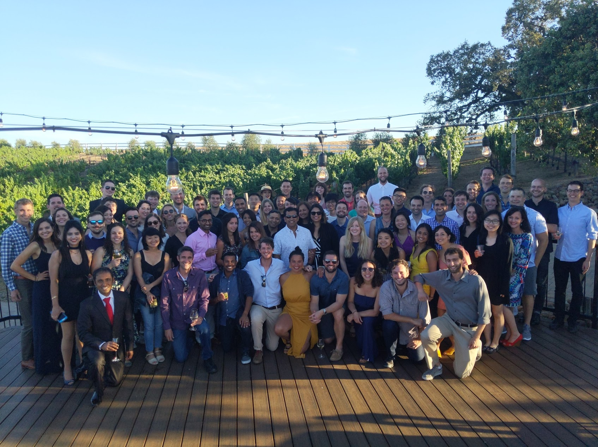
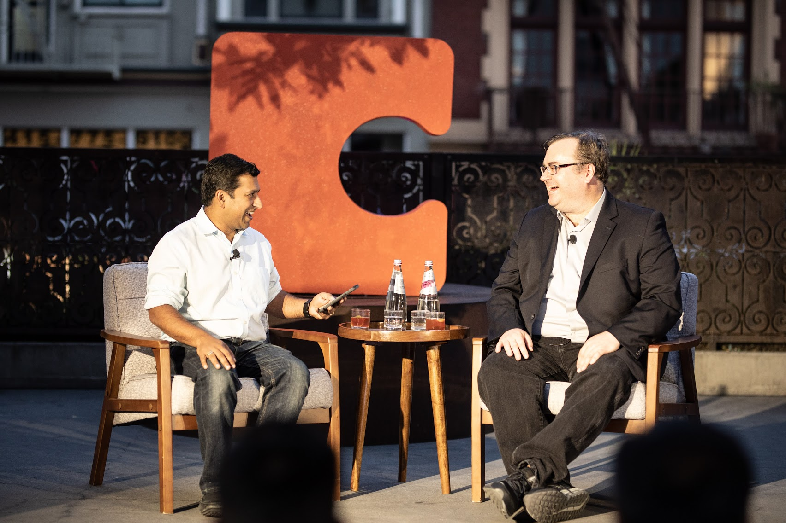
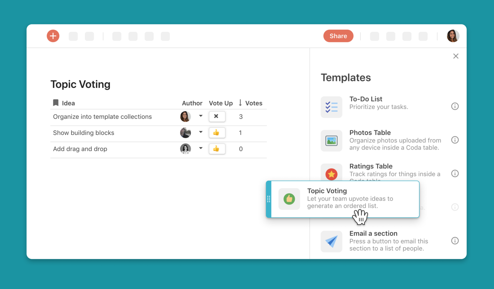
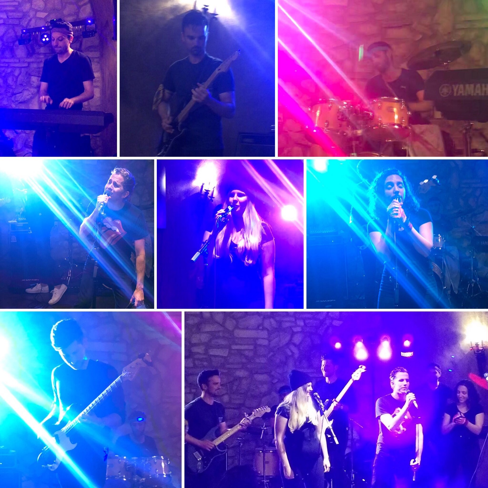

Myriad images come to mind when one hears the ubiquitous Silicon Valley label “startup”: cramped office quarters, perhaps borrowed from a parent or roommate; moving “fast” and breaking “things”; Richard from HBO’s Silicon Valley. When I tell people I work at Coda, a startup, I usually qualify the word and its associations by describing Coda succinctly as a “grown-up” startup.

What I mean by that is that we do things a bit differently than a lot of startups in the Valley, with the goal of both building for the long-term, as well as attracting a broad range of talent. I’ll walk through what this means, but first I’ll contextualize it a bit to explain why we do it.

###About Coda###

<iframe width="560" height="315" src="https://www.youtube.com/embed/M2tNj1CYp_A" frameborder="0" allow="accelerometer; autoplay; encrypted-media; gyroscope; picture-in-picture" allowfullscreen></iframe>

If you’re reading this, you probably have some idea of what we’re up to, but in short, we’re reinventing the collaborative document to allow people to create documents as powerful as applications. In a phrase: super docs. Picture the messy spreadsheet used to coordinate a team’s various launch and planning activities, now picture it upgraded significantly with all the features and visualizations you wish it had. That’s Coda. (Oh, and fun apps like this deathpool we launched for the end of that other HBO show.)
One important point about this endeavor — it’s a big one. Rather than building a business which markets a smaller, niche tool, we are literally taking on Google Docs, Google Sheets, Excel, Word, a variety of product-management apps, as well as a long tail of bespoke apps like those used to vote on all-hands questions. It’s an ambitious undertaking, and to achieve it we need to hire systems thinkers who execute consistently over a long period of time. We also need to make decisions that will grow as the business does — so we aren’t reinventing a process when we hit increasing milestones of company size, or revenue.

There’s a saying about company culture — that it stems from the founders. I’ve found this to be true at every startup I’ve worked at, this being my third full-time startup role, with two others in a part-time or advisory capacity. In that respect, Coda’s maturity as a culture stems from Shishir and Alex, our co-founders and CEO and CTO respectively. Shishir was formerly an executive at YouTube, overseeing the product management, engineering and design teams; Alex was an engineering leader at Microsoft and sold a startup to Google. They have both run mature businesses at scale, and are not first-time founders, so they understand the need to design a work culture that incorporates the habits and preferences of a wide variety of people. Both have young children, and as a result, they know how to plan their time in the office to get home to their families; you won’t see either of them stalking the halls at 9 p.m., peering into workstations, as some founders are known to do. Consequently, Coda has a ‘get work done where you need to get it done’ ethic that allows people to live their lives outside of Coda, too — whether it be with their families or other passions.

###Fostering a family-friendly work culture###

Perhaps the most visible manifestation of our “grown-up” tendency is in the experience of our employees. Codans (aka Coda employees; we still have the silly tech tendency of giving ourselves ridiculous proper noun names) have a broader age range than what you might find at other companies in Silicon Valley, and with this range comes a breadth of experience, from startups to big companies. Consequently, we make deliberate decisions about everything from the system font we use (San Francisco on Mac, Segoe on a PC) to what to call our workflow feature (“automations”).

A byproduct of our slightly advanced median age, is that many Codans have families, and — unsurprisingly — want to spend time with them. This means that meetings which meander past the 5:30 pm mark are often cut off in favor of quick decisions and, if necessary, a Slack conversation later, so that parents can get to daycare / elementary school pickup and dinner. Some people then ‘plug back in’ later in the evening, once the kiddos are in bed, though more often than not they don’t — most people just try to get their work done in work hours, and go home to recharge. We have a serious work ethic culture, but we try not to overdo it.

Because we know that there’s life outside of the office walls, working remotely is not only acceptable, it’s often the norm, and most Codans work from home occasionally to take care of kids / pets / the cable installation unhelpfully scheduled between 6 a.m. and 7 p.m. All our conference rooms have high-definition videoconferencing, and we’re heavy users of Zoom (bonus — the ‘touch up feature which make us look like the airbrushed, model versions of ourselves). It’s not uncommon to dial into a Coda meeting to see a Brady Bunch of faces joining — from our offices and couches. (One of our founding engineers, Fil, wrote a great post about the benefits of Zoom’s blue screen feature for enlivening remote team meetings.)

The best part of our family-friendly work culture is that we don’t merely allow for work to exist around family time, we actively encourage family involvement at Coda. Our annual work retreat is aptly named the ‘Coda Family Trip,’ and spouses, partners, and children are invited and encouraged to attend. I’ve known some Codans’ children since they were newborns, and who are now running around and playing with my own daughter. This connection to the full lives of our colleagues — not just their buttoned-up (or, let’s be honest — hoody-clad) work selves — helps us in the workplace. You work well with, and intuitively trust, people you know well.

If you’re looking for a place with people who like to work together but also make time for family and personal passions — this might be your kind of startup.

###Punching above our weight for talent###

We have broad ambitions and are building a stable product for the long-term — this takes time and investment. As a result, we need to attract and retain talent that can help us build and market a large, fully-featured product. When Shishir initially considered the path of creating a startup for his vision of reinventing documents, a major concern was competing with the tech heavyweights for talent. He didn’t want to go far on this journey only to lose out to deep-pocketed incumbents because of their ability to pay more for top talent. So we raised some money, and now we can hire not only entry-level talent for engineering, marketing, and product roles, but senior, experienced people who are being wooed by the likes of Facebook, Google, and Amazon.

Similarly, it means our culture doesn’t feel as strapped as that of many startups which, if not literally, are practically incubated in the proverbial garage. We do have some of the stereotypical perks like snacks and swag. More importantly, from the very beginning of Coda, Shishir and Alex wanted to ensure the company could support people who wanted to work on an innovative new idea in a small company, but who also had families to support. So at Coda we have both competitive compensation and great health benefits. (Some employees have said our benefits are even better than what big companies offer; for instance, our most popular health plan has a $0 premium for employees and their families — Coda pays for it.)

###Deciding deliberately — with broad input to make sure all voices are heard###

A stereotype of startup life is that you’re constantly lurching from one crisis to the next, trying to stay above water and barely putting a strategic plan together. While this isn’t always the case, of course, it is common for small, emergent companies to view major events as make-or-break — a key customer that may churn, risking entire revenue forecasts (and as a result, payroll); a well-entrenched competitor releasing a feature that is, admittedly, your entire product.

Largely owing to Shishir’s deliberate decisionmaking, we regularly take a step back to assess our performance and plans, adjusting them in increments longer than just sprints or even quarters. When we planned to launch several key features, in October of 2018, we put together a plan that carried us through 2020 for major milestones, and we’ve stuck to it ever since. When we have product design reviews, we don’t just consider the immediate possibility of a user interaction — what happens when someone with a very common use-case does some behavior — but we push ourselves to imagine scenarios that aren’t even happening yet — what happens when a user is using her Coda doc in a different localized version, how will the sharing dialogue need to change (for example). The “cadence” of our work can seem methodical, even plodding at times — but that’s exactly the point. It’s an ultramarathon, not a sprint.

One of the major ways we strive to make deliberate decisions is to ensure all voices in the company are heard (if they want to be) when we’re debating important topics. We hold a twice-weekly meeting, called “Coda Catalyst,” in order to drive action, in which we review plans — from new feature designs to marketing launch plans. It’s optionally attended by the entire company, and people are encouraged to express their sentiment on the plan, and add and vote on questions for the team presenting, both using our in-doc templates for topic voting and sentiment tracking. Rather than letting the loudest voice in the room carry the day, we quietly read plans and add and vote on questions, letting everyone get their (nonverbal) say.

This methodical pace may seem slow to some. To us, it’s deliberate, allowing us to build a deep bench (of talent or technology). Our focus is not primarily on speed, but rather on getting the product and go-to-market experience right. This can often seem antithetical in the speed-obsessed world of Silicon Valley. When we launched some major features last fall at a customer event, Reid Hoffman was asked by an audience member about his famous quote that if “you’re not embarrassed by the first version of your product, you’ve launched too late,” in reference to how long Coda had been in stealth (we were for 3 years, and in beta for just over a year). He pointed out that, for B2B applications, it’s very important to get things right, since you’re dealing not with stickers on photos but with companies’ data. And also, for a paradigm-shifting effort like Coda, you have to design things thoughtfully and not just, well, ship from the hip.

###Don’t get me wrong — it’s still a startup###

All of this being said, joining Coda will feel a lot more like a zany little company than an established, or even a growth-stage company. We have a Sonos and play music in the office at nearly all times (favorite playlist is the ’80s training montage). Once, a remote employee VPN’d into the office network and Rickrolled us. We use Slack to communicate, and for fun things, like irritating a colleague on their birthday. We play Spikeball and hold ultimate frisbee tournaments. We even have a band. And more importantly, we have the foundational, existential parts of a startup: the feeling of your own work being impactful to the entire company; building close friendships with colleagues working hard on challenging problems; seeing our work in the world in the hands of our users. If that (and yes, the swag and the Spikeball) sound good to you, check out our jobs page. We’re hiring.