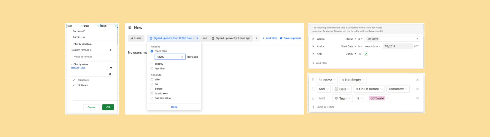

At Coda, one of our design principles is inspired by computing pioneer Alan Kay’s quote, “simple things should be simple, complex things should be possible.” In our early years, we gravitated toward the latter. We wanted to build a surface with nearly infinite possibilities. We wanted you to be able to take actions and automate workflows, all in a doc. Now that we’ve done that, we’re going back to basics — and making simple things simple.

For example, filtering. Until now, the only way to create a filter was by writing a formula. If you just wanted to filter a set of tasks by their status, you might write something like this:

While this allows all kinds of advanced scenarios, makers told us that having to write formulas made the simple things feel complex. We set out to design a new filtering experience to better deliver on Alan Kay’s principle.

###Filtering around the web###
As a first step, we looked around at how other productivity applications handle filtering. Interestingly, many of them used a pattern we call “Formula Mad Libs”. In this model, you navigate a series of drop-downs and text boxes to construct a filter. Although these apps don’t require you to write formulas, it still feels a lot like writing formulas by filling in the blanks:

But that didn’t quite satisfy Alan Kay’s principle either. The simple things didn’t feel simple enough, and the user experience set unnecessary limitations on the complex scenarios that were possible.

In pursuit of a simpler filtering experience, we broadened our search to consumer apps like e-commerce, travel & real estate websites. Instead of Formula Mad Libs, we saw some delightful experiences like custom-built sliders for numeric ranges, calendars for dates, icons for star ratings or dollar signs and toggles for Yes/No options. It felt more intuitive to filter results by directly manipulating controls rather than adding values into blank text boxes.

Those user experiences felt compelling because the controls were tailored to a specific type of data. For example, Kayak knows all flights have a price, date, airline, etc., and can optimize the dashboard accordingly. Coda is a different animal. Because makers use Coda for all kinds of data and for all kinds of use cases, our filter experience needed to be flexible, yet tailored to the specific data type.

###Making simple things simple###

When we designed the Coda Mobile experience, we wanted each doc to feel like a native app, without any extra work on the maker’s part. We wanted filtering to feel just as seamless.
Today, we’re announcing a simpler, more intuitive filtering experience. Just select the column you want to filter, and Coda will give you a set of intuitive controls based on your data. No formulas necessary.

You can manipulate the controls directly and see the results immediately. And they work for all the 16 different types of data we support in Coda, including text, number, checkbox, select list, date, time and so on.

###Making complex things possible###

Given the wide range of scenarios people use Coda for, we needed more than one simple control for each Column Format. For example, on a column containing tags, you might not want to filter only by the value of the tags. You may want to see any items where the tags are not blank, or constrain to a specific number of tags. To support different scenarios, we designed a modular system of controls that worked for all the different combinations of column formats and operators.

Many people also wanted to specify more than one criterion, so we built in a way to add as many different rules as needed. You can even add more than one filter on the same column to accomplish more complex scenarios.

Unlike e-commerce websites, people who use productivity applications often want to create slightly more advanced logical combinations of AND and OR. Instead of forcing you to write formulas for these scenarios, you can create different combinations without the need for formulas. To match the behavior of other filtering experiences on the web, new filters are joined by AND by default. When you’re done adding the filters, they collapse and give you a summary in plain English.

###So, what about formulas?###
For all our effort to remove the need for formulas, they remain a very important building block in Coda. They allow Coda to have the possibility of creating things that cannot be built with any other product. Accordingly, we continue to allow you to create filters using formulas like before just by clicking the formula button on top.
But we didn’t stop there. We believe that people shouldn’t have to choose between writing formulas and using the intuitive controls. At times, some of the rules you want to filter are simple enough to not require a formula, while others can only be written using formulas. So we built a way for makers to create filters using a combination of formulas and simple builders.

While our goal was to remove the need for formulas in simple cases, we also saw an opportunity to help people feel more comfortable using formulas. Since each of the builders can be represented using formulas, we enabled users to see the underlying formula for any builder. We think this is a great way to learn the formula language and have even more control by modifying the underlying formulas.

We also didn’t want switching to formulas to be a one-way path, so the new experience even allows you to convert the formulas you write back into builders. As a result, we’ve upgraded any existing filters you had created using formulas to the new experience, so you can now modify them easily and see a summary of your filters in plain English.

We hope this change makes filtering your data simpler and a little more pleasant. So what are you waiting for? Go ahead, try Coda, and filter some stuff out of your docs. And of course, tell us what you think in the comments below.