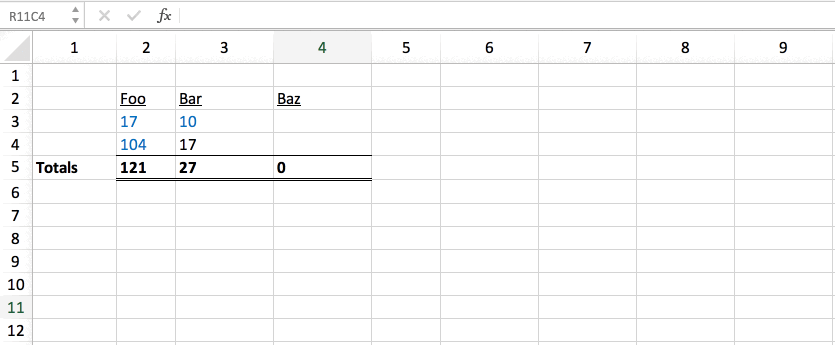

From the very first napkin sketches of Coda (and yes, there were actual napkin sketches passed around at coffee shops, bars, or whatever office we happened to be squatting in), two things were abundantly clear: (1) we were obsessed with the idea of building a doc as powerful as an app and (2) at the center of that design had to be a table.

And when I say “table”, I don’t mean a collection of adjacent cells in a Google Sheet or Excel file, nor the “tables” you might find in Microsoft Word or Google Docs that allow you to align columns of text vertically or horizontally. We knew that real applications needed real tables ー tables where rows and columns are distinctly different. We needed the relational database table ー one that has the ability to reliably join against other tables at scale through primary keys, foreign keys, and indices.

Benedict Evans wrote a piece last summer about Machine Learning that articulated some of the relevant history around relational databases well:

> Why relational databases? They were a new fundamental enabling layer that changed what computing could do. Before relational databases appeared in the late 1970s, if you wanted your database to show you, say, 'all customers who bought this product and live in this city', that would generally need a custom engineering project. Databases were not built with structure such that any arbitrary cross-referenced query was an easy, routine thing to do. If you wanted to ask a question, someone would have to build it. Databases were record-keeping systems; relational databases turned them into business intelligence systems.
> 
> This changed what databases could be used for in important ways, and so created new use cases and new billion dollar companies. Relational databases gave us Oracle, but they also gave us SAP, and SAP and its peers gave us global just-in-time supply chains - they gave us Apple and Starbucks. By the 1990s, pretty much all enterprise software was a relational database - PeopleSoft and CRM and SuccessFactors and dozens more all ran on relational databases. No-one looked at SuccessFactors or Salesforce and said "that will never work because Oracle has all the databases" - rather, this technology became an enabling layer that was part of everything.
> 

As Benedict identified, relational databases became the center of nearly all applications. So if we were going to build docs that could grow into apps, a solid foundation of relational data was a must. The primary question then was how were we going to do that. Did we have to abandon the spreadsheet model entirely, or could we keep aspects of it while introducing table-like concepts? Even subtle differences in these options would end up having pretty big implications on the formula language, on our ability to create a compelling mobile experience, and on the familiarity of the surface itself and the backwards compatibility with other tools.

###A primer on spreadsheets###
To really put the choice in context, you have to understand how spreadsheets actually work. At Coda, we’ve always been humbled by the power and flexibility of a spreadsheet ー regularly making the case that spreadsheet formulas are the most popular programming language in the world. However, most spreadsheet users don’t realize that there’s an alternate to the common A1:B14 style of referencing ー known as R1C1. You can read a bit more about the details of it on excel champs, but R1C1 is kind of like the metric system for spreadsheet formulas. By using R1C1 notation, it becomes easier to see how spreadsheets actually work ー based on the relative position of a cell, not just its absolute position (e.g. in B2). Said differently, when you write a spreadsheet formula of =B2 in cell C3, the underlying formula is actually an offset: =R[-1]C[-1] → “give me the value one row and one column before me”. This is why when you copy and paste the C3 cell to D3, the formula remaps to =C2 ー you’re actually pasting the same underlying value of the formula (offset by one column and one row), it just has a different display name.

