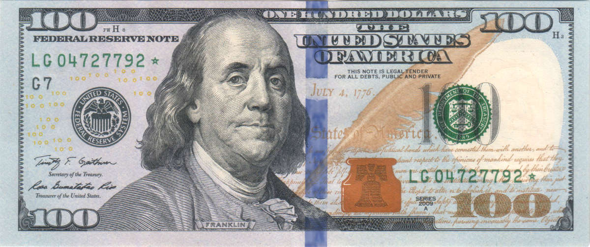

I take “Time is money” literally.

Stop lying to yourself. You’re not too busy, you’re just in “time debt” ー and there’s a way out.

I’ve spent most of my career thinking about resource management. I started off in finance thinking about money management ー budgets, forecasts, and spending analyses. And as my career shifted into product management, the focus became time rather than money. But, compared to money management, time management is relatively underserved ー there just aren’t enough great tools for it and the best practices are hard to quantify.

Go ask someone how they spend their week and you’ll get some hand waving, loose guesses, and lots of uncertainty. Now ask them what they spend on rent or a mortgage every month and you’ll get a crisp number along with a rich set of guidelines for how much that should be based on your financial situation. How should a product manager budget their time? How should a sales leader be spending theirs?

